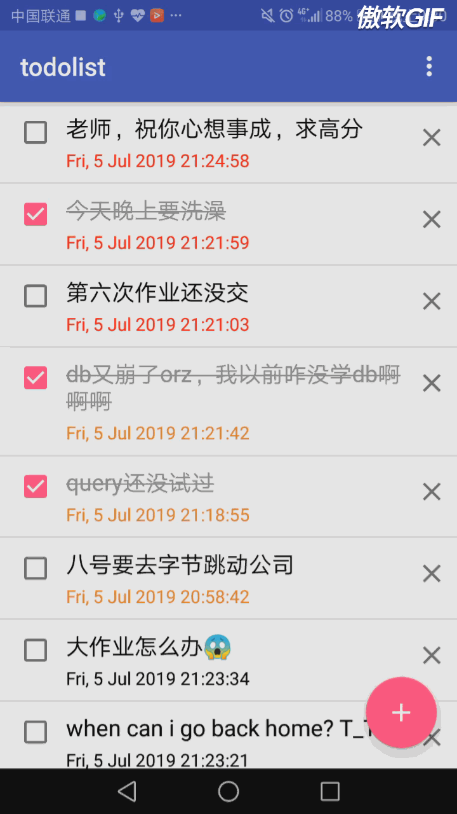
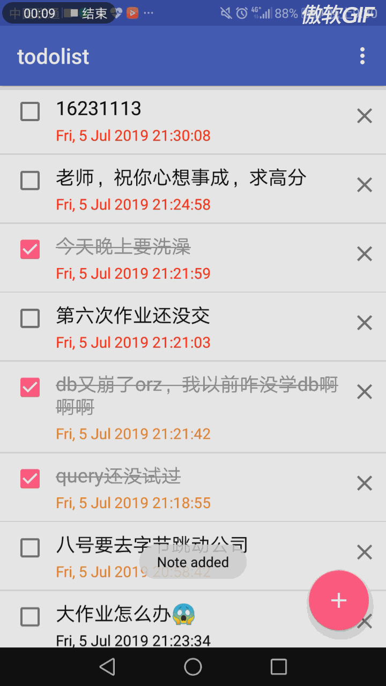
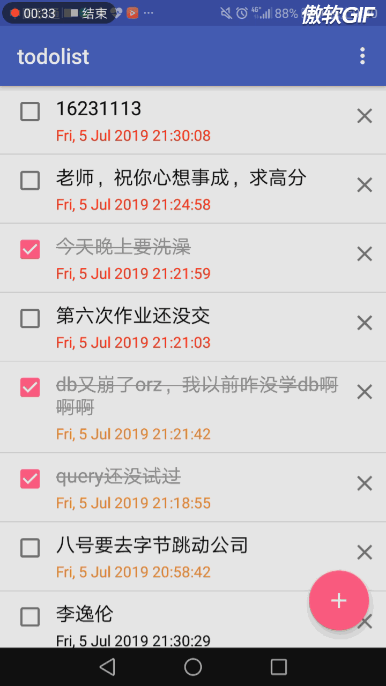

# todoList app：

#### 这次用SQLite完成了一个todoList，带有优先级，基本功能如下：

#### 除了增加之外，还可以修改状态为完成，然后还支持删除

#### 除此之外还能够对表中的内容和优先级进行修改

#### 注意，这里只有打勾的时候会在内存里先改好再放到数据库里，插入和该内容、优先级都是先改完数据库再重新拉下来的，说不定下次可以用id查一个再拉数据，或者用Intent data传输返回数据然后在内存中更改note